# Introducción al *machine learning*

---

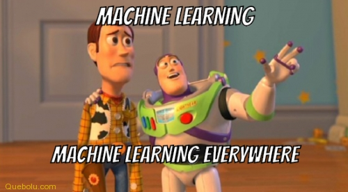

---

## ¿Qué NO es el *machine learning*?

---

 
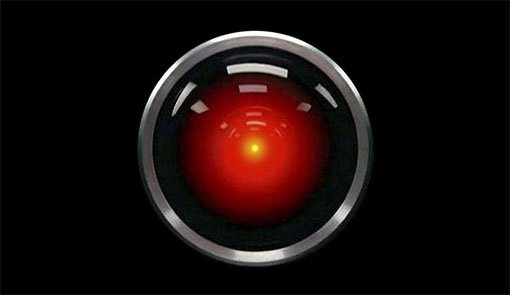

---

 

---

## ¿Qué es el *machine learning*?

---

El *machine learning* es estadística disfrazada

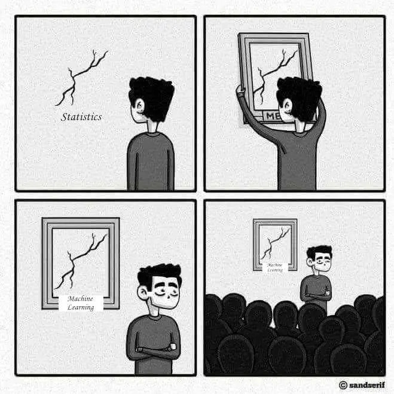

---

*Machine learning* = algorítmica + matemáticas

---

¿*Machine learning*?

---

Una mejor denominación para *machine learning* es *learning from data*.

---

1. Sin **datos** no hay **aprendizaje**
2. Sólo se **aprende** lo que está en los **datos**

---

## ¿Por qué ~~queremos~~ necesitamos el *machine learning*?

---

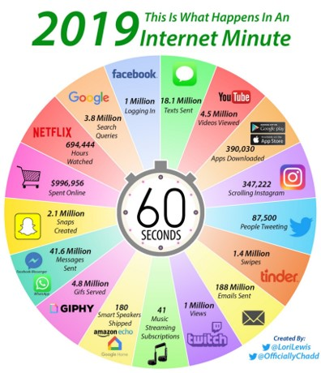

---

---

### ¿Por qué?

- Necesitamos obtener conocimiento de grandes volúmenes de datos
- Los ordenadores son muy buenos calculando:
  - Velocidad de ejecución
  - No incorporan sesgos
  - No se cansan, trabajando 24/7
  - Precisión en los cálculos

---

### Algunas aplicaciones

- Visión por computador
  - Conducción autónoma, detección de cáncer, ...

- Reconocimiento del habla
  - Siri, Alexa, OK Google, ...

- Procesamiento del lenguaje natural
  - Traducción automática, chat bots, ...

- Detección de patrones
  - Sistemas de recomendación, detección de fraude, análisis de comportamiento en webs, ...

---

El *machine learning* es una disciplina de la **inteligencia artificial**

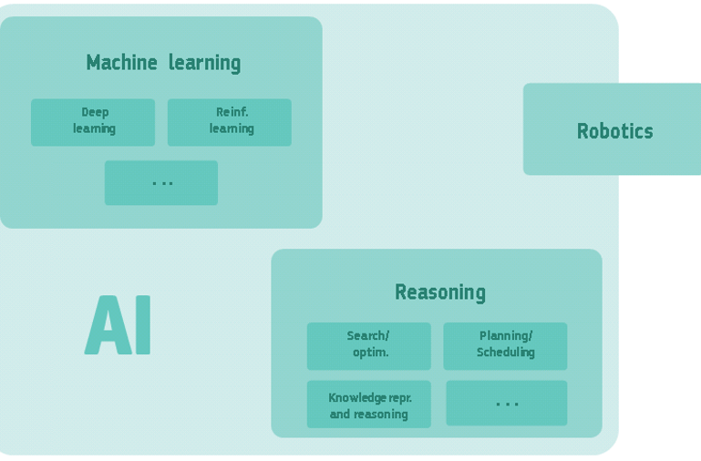

---

Dos enfoques:

---

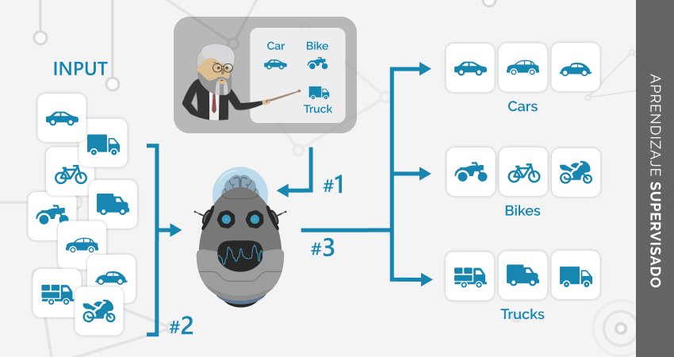

---

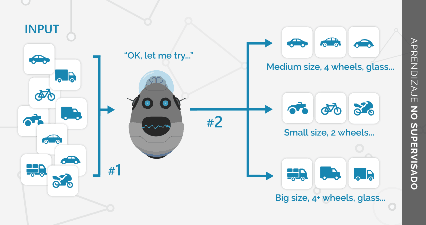

---

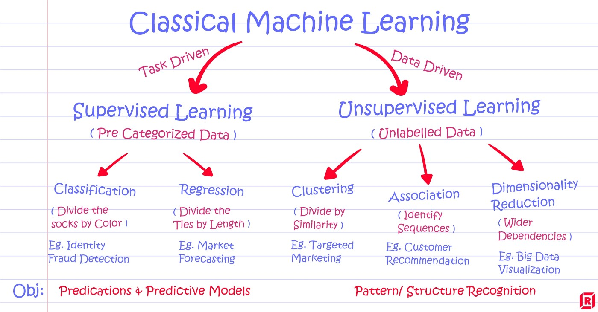

---

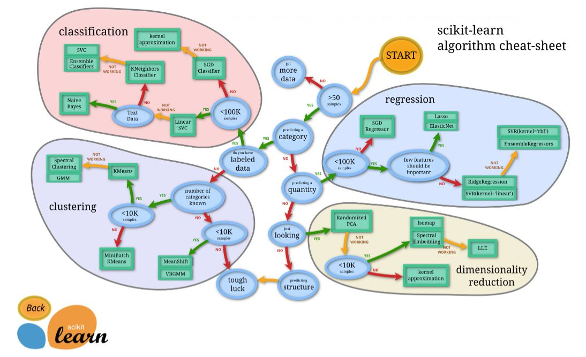

---

## Proyectos *machine learning*

---

Nomenclatura de un *dataset*:

| Feature 1       | Feature 2       | ... | Feature N       | Label   |
| --------------- | --------------- | --- | --------------- | ------- |
| Observation 1,1 | Observation 1,2 | ... | Observation 1,N | Label 1 |
| Observation 2,1 | Observation 2,2 | ... | Observation 2,N | Label 2 |
| ...             | ...             | ... | ...             | ...     |
| Observation M,1 | Observation M,2 | ... | Observation M,N | Label M |

---

*Dataset* de ejemplo:

| Latitude   | Longitud   | Timestamp  | Temperature   |
| ---------- | ---------- | ---------- | ------------- |
| 40,3214873 | -3,8123123 | 1587980647 | 18,3          |
| 18,9230112 | 15,2394502 | 1587984567 | 6,4           |
| ...        | ...        | ...        | ...           |
| -7,2321231 | 10,7234433 | 1587968742 | 25,7          |

---

El proceso de la ciencia de datos

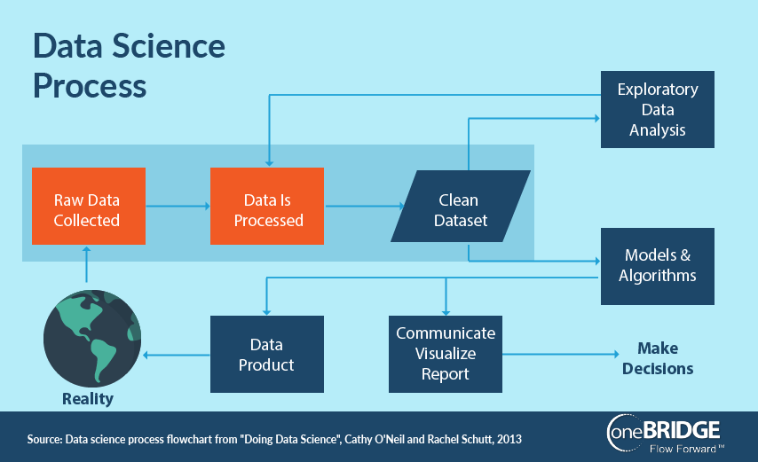

---

*Machine learning* paso a paso:

---

Proceso de evaluación:

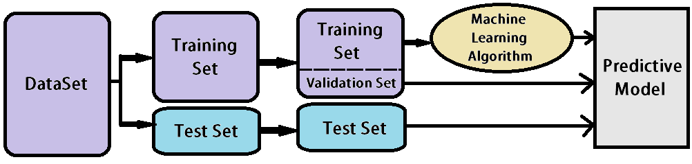

---

Conseguir el modelo perfecto:

