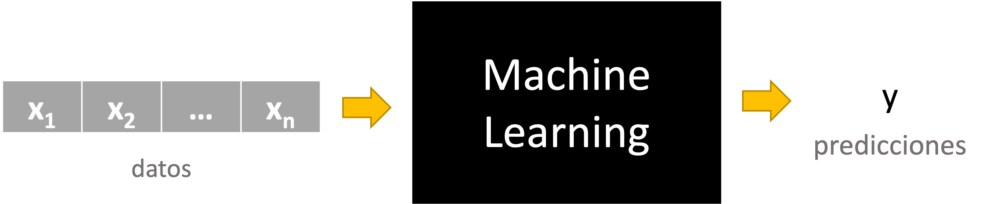
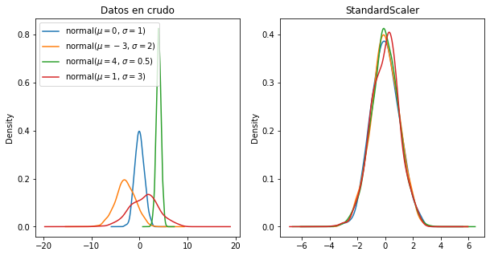
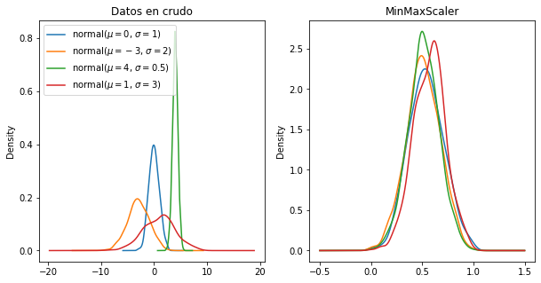
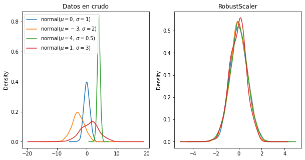

<!--
_header: ''
_footer: <br>Esta obra está bajo una [licencia de Creative Commons Reconocimiento-NoComercial-CompartirIgual 4.0 Internacional](http://creativecommons.org/licenses/by-nc-sa/4.0/). Icono diseñado por Flaticon
-->

# Preprocesamiento de datos

Machine Learning

---

<style type="text/css">
    img {
        background-color: transparent!important;
    }
</style>

## ¿Cómo funciona un algoritmo de *machine learning*?



---

## Tipos de datos

- Datos numéricos: 1, 4, 3.14, 19.8, -3...
- Booleanos: verdadero o falso
- Texto:
    - Texto restringido (categorías): "hombre" | "mujer", "insatisfecho" | "neutral" | "satisfecho"
    - Texto libre: "El producto adquirido ha superado mis expectativas"
- Imágenes
- Sonidos
- Otros datos complejos: *arrays*, *objetos*, etc.

---

## Preprocesamiento de datos

- Para que un algoritmo de *machine learning* pueda funcionar necesita que los datos que recibe estén en un formato adecuado.
- Los algoritmos de *machine learning*, por lo general, se basan en operaciones matemáticas sobre los datos de entrada.
- Los datos de entrada deben ser **NÚMEROS**.
- A la transformación de un conjunto de datos en otro que pueda ser utilizado por un algoritmo de *machine learning* se le conoce como **preprocesamiento de datos**.

---

<style>
th { background-color: #E3E3E3; }
table {
    margin-left:auto; 
    margin-right:auto;
}
</style>

## Conjunto de datos

Los algoritmos de *machine learning* reciben como entrada un conjunto de datos (*dataset*):

| $X_1$     | $X_2$      | $\dots$  | $X_n$     | $y$      |
| --------- | ---------- | -------- | --------- | -------- |
| $x_{1,1}$ | $x_{1,2}$  | $\dots$  | $x_{1,n}$ | $y_1$    |
| $x_{2,1}$ | $x_{2,2}$  | $\dots$  | $x_{2,n}$ | $y_2$    |
| $\vdots$  | $\vdots$   | $\ddots$ | $\vdots$  | $\vdots$ |
| $x_{m,1}$ | $x_{m,2}$  | $\dots$  | $x_{m,n}$ | $y_m$    |

---

## Preprocesamiento de datos

- Es necesario transformar las columnas ($X_i$) en función del tipo de datos que contengan:
    - Datos numéricos: `StandardScaler`, `MinMaxScaler` o `RobustScaler`
    - Datos discretos: `OneHotEncoding` u `OrdinalEncoder`
    - Texto libre: `CountVectorizer`
    - Imágenes: codificar la imagen de forma correcta
- La variable objetivo ($y$) no se debe transformar

---

## Preprocesamiento con `sklearn`

- Con `sklearn` todas las transformaciones se encuentran en el módulo `sklearn.preprocessing`.
- Su interfaz es homogénea:
    - `fit()` para aprender los parámetros de la transformación.
    - `transform()` para transformar.
    - `fit_transform()` para aprender y transformar en un solo paso.
    - `inverse_transform()` para devolver los datos a su forma original.

---

## `StandardScaler`

- La **estandarización** es el proceso a partir del cual un conjunto de datos son transformados a una distribución normal con media 0 y desviación típica 1.

- Matemáticamente:  $x^\prime_i = \frac{x_i - \mu}{\sigma}$

- Con `sklearn`:

```python
from sklearn.preprocessing import StandardScaler
X_transformed = StandardScaler().fit_transform(X)
```

--- 

## `StandardScaler`



---

## `MinMaxScaler`

- El `MinMaxScaler` ajusta un conjunto de números a otro en el rango $[0,1]$ (o los valores deseados).

- Matemáticamente: $x^\prime_i = \frac{x_i - min}{max-min}$

- Con `sklearn`:

```python
from sklearn.preprocessing import MinMaxScaler
X_transformed = MinMaxScaler().fit_transform(X)
```

---

## `MinMaxScaler`



---

## `RobustScaler`

- El `RobustScaler` se caracteriza por transformar los datos empleando estadísticos robustos a los valores atípicos (*outliers*). 

- La transformación se realiza suprimiendo la mediana y escalando los datos de acuerdo con su rango intercuartílico.

- Con `sklearn`:

```python
from sklearn.preprocessing import RobustScaler
X_transformed = RobustScaler().fit_transform(X)
```

---

## `RobustScaler`



---

## `OneHotEnconder`

<style>
table {
    margin-left:auto; 
    margin-right:auto;
    font-size: 0.7em;
}

</style>

- *One Hot Encondig* es una técnica empleada para transformar datos categóricos en valores numéricos.
- Consiste en generar tatas nuevas columnas como valores categóricos tenga la variable analizada y asignar valores 0 ó 1 en función el valor de la muestra.

| Nombre | Sexo   | $\rightarrow$ | Hombre | Mujer |
| :----: | :----: | ------------- | :----: | :---: |
| Alice  | mujer  | $\rightarrow$ | 0      | 1     |
| Bob    | hombre | $\rightarrow$ | 1      | 0     |
| Carl   | hombre | $\rightarrow$ | 1      | 0     |
| Denna  | mujer  | $\rightarrow$ | 0      | 1     |

---

## `OneHotEnconder`

- Con `sklearn`:

```python
import numpy as np
from sklearn.preprocessing import OneHotEncoder

X = np.array([['mujer' ],
              ['hombre'],
              ['hombre'],
              ['mujer' ]])

OneHotEncoder().fit_transform(X)
```

---

## `OrdinalEnconder`

- `OrdinarEncoder` asigna un valor numérico ordinal creciente a las categorías.
- Por defecto, los valores se asignan por orden alfabético de las categorías.
    - Es conveniente fijar el orden.

| Matrícula | Color  | $\rightarrow$ | Color |
| :-------: | :----: | ------------- | :---: |
| 0231PLF   | rojo   | $\rightarrow$ | 2     |
| 3924RTS   | azul   | $\rightarrow$ | 0     |
| 9862GYL   | negro  | $\rightarrow$ | 1     |
| 9211DGP   | azul   | $\rightarrow$ | 0     |

---

## `OrdinalEnconder`

- Con `sklearn`:

```python
import numpy as np
from sklearn.preprocessing import OrdinalEncoder

X = [['deficiente'],
     ['correcto'],
     ['muy deficiente'],
     ['mejorable' ]]

OrdinalEncoder(categories=[['muy deficiente', 'deficiente', 'mejorable', 'correcto']]).fit_transform(X)
```

---

## `CountVectorizer`

- `CountVectorizer` aplica la técnica de *Bag of Words* para transformar texto libre en valores numéricos.
- Primero se construye un diccionario con todas las palabras existentes.
- Luego se transforma cada texto en tantas columnas como entradas tenga el diccionario y se especifica el número de apariciones de cada palabra en el texto.

---

## `CountVectorizer`

- Con `sklearn`:

```python
from sklearn.feature_extraction.text import CountVectorizer

corpus = [
    "El miedo es el camino hacia el lado oscuro, el miedo lleva a la ira, la ira lleva al odio,
     el odio lleva al sufrimiento, el sufrimiento al lado oscuro."
]

X = count_vectorizer.fit_transform(corpus)

count_vectorizer.get_feature_names() # ['al', 'camino', 'el', 'es', 'hacia', 'ira', 'la', 'lado', 
                                     #  'lleva', 'miedo', 'odio', 'oscuro', 'sufrimiento']

X.toarray() # [[3 1 6 1 1 2 2 2 3 2 2 2 2]]
```

---

## Preprocesamiento de imágenes

- En informática, las imágenes se almacenan en los ordenadores como una matriz de $w x h$ que representa los píxeles de la imagen.
- Cada píxel contiene un valor numérico que indica como de *blanco* tiene que ser un píxel.
    - Para imágenes a color, se tiene 3 matrices que representan lo rojo, verde o azul de cada píxel.
- La transformación clásica de estas imágenes almacenadas en una matriz de dos dimensiones a una vector mediante la concatenación de las filas de las que se compone la imagen.

---

## Preprocesamiento de imágenes

- Con `numpy`:

```python
import numpy as np

img = np.array([[0,0,0,0],
                [0,255,255,0],
                [0,255,255,0],
                [0,0,0,0]], dtype=np.uint8)

img.ravel() # [0,0,0,0,0,255,255,0,0,255,255,0,0,0,0,0]
```

---

## *Feature Engineering*

- En algunas ocasiones, los datos a pre-procesar no son estándar.
- Cuando esto sucede recurrimos a hacer *feature engineering*.
- *Feature engieneering* engloba todas las técnicas no triviales para transforma datos.
- Son soluciones hechas *ad-hoc* para preprocesar datos en un problema específico.
- Es importante resaltar que la forma en la que evaluamos si un preprocesamiento es correcto es mediante la calidad de las predicciones finales.